# Simulated Walker Damage & Recovery

[](https://www.python.org/downloads/)
[](https://pytorch.org/)
[](https://github.com/DLR-RM/stable-baselines3)
[](https://gymnasium.farama.org/environments/box2d/bipedal_walker/)
[](https://github.com/geomj)
[](LICENSE)


> **Project Author & Lead**: **Geo Mathew Joseph**  
> A self-contained Reinforcement Learning research pipeline demonstrating the artificial simulation of **neural lesion damage ("brain damage")** on a trained bipedal locomotive agent (`BipedalWalker-v3`), and its subsequent **functional motor recovery (neuroplastic rehabilitation)** across a gradient of lesion severities.

---

## Table of Contents

- [1. Executive Summary](#1-executive-summary)
- [2. Biological & RL Framing](#2-biological--rl-framing)
- [3. 3D Robotics & WebGL Simulation Suite](#3-3d-robotics--webgl-simulation-suite)
  - [3.1 Interactive 3D WebGL Bipedal Robotics Laboratory (Three.js)](#31-interactive-3d-webgl-bipedal-robotics-laboratory-threejs)
  - [3.2 High-Fidelity 3D Robot Models](#32-high-fidelity-3d-robot-models)
  - [3.3 3D MuJoCo Physics Pipeline & HD Telemetry Video](#33-3d-mujoco-physics-pipeline--hd-telemetry-video)
- [4. System Architecture & Pipeline](#4-system-architecture--pipeline)
- [5. Neural Damage Mechanics](#5-neural-damage-mechanics)
  - [5.1 Mode 1: Neuron Kill (Structural Ablation / Focal Lesion)](#51-mode-1-neuron-kill-structural-ablation--focal-lesion)
  - [5.2 Mode 2: Weight Zeroing (Diffuse Synaptic Loss)](#52-mode-2-weight-zeroing-diffuse-synaptic-loss)
  - [5.3 Mode 3: Noise Injection (Synaptic Dysregulation)](#53-mode-3-noise-injection-synaptic-dysregulation)
  - [5.4 The Actor-Critic Asymmetry Principle](#54-the-actor-critic-asymmetry-principle)
- [6. Project Directory Structure](#6-project-directory-structure)
- [7. Installation & Environment Setup](#7-installation--environment-setup)
- [8. Step-by-Step Usage Guide](#8-step-by-step-usage-guide)
  - [Phase 1: Environment & Sanity Verification](#phase-1-environment--sanity-verification)
  - [Phase 2: Baseline Healthy Agent Training](#phase-2-baseline-healthy-agent-training)
  - [Phase 3: Video Recording & Kinematic Evaluation](#phase-3-video-recording--kinematic-evaluation)
  - [Phase 4: Targeted Damage Injection](#phase-4-targeted-damage-injection)
  - [Phase 5: Recovery Retraining](#phase-5-recovery-retraining)
  - [Phase 6: Full Automated Experiment Matrix](#phase-6-full-automated-experiment-matrix)
  - [Phase 7: Analytics & Visualization](#phase-7-analytics--visualization)
  - [Phase 8: Intensive Evolutionary Curriculum Training](#phase-8-intensive-evolutionary-curriculum-training)
  - [Phase 9: Evolutionary Resilience Benchmark & 3D Video](#phase-9-evolutionary-resilience-benchmark--3d-video)
- [9. High-Fidelity Video HUD & Visual Telemetry](#9-high-fidelity-video-hud--visual-telemetry)
- [10. Experimental Results & Empirical Analytics](#10-experimental-results--empirical-analytics)
  - [10.1 Master Research & Evolution Synthesis Dashboard](#101-master-research--evolution-synthesis-dashboard)
  - [10.2 Executive Summary Dashboard](#102-executive-summary-dashboard)
  - [10.3 Baseline Training Dynamics](#103-baseline-training-dynamics-2000000-steps)
  - [10.4 Severity Matrix Empirical Results](#104-severity-matrix-empirical-results)
  - [10.5 Comparative Trajectory Curves & Damage Impact](#105-comparative-trajectory-curves--damage-impact)
  - [10.6 Evolutionary Neuro-Resilience Benchmark](#106-evolutionary-neuro-resilience-benchmark-standard-vs-evolved-agent)
  - [10.7 3D Multi-Body Robotics Benchmark & Recovery Dynamics](#107-3d-multi-body-robotics-benchmark--recovery-dynamics)
- [11. Technical Engineering Decisions & Gotchas](#11-technical-engineering-decisions--gotchas)
- [12. Author & Citation](#12-author--citation)

---

## 1. Executive Summary

Living organisms demonstrate remarkable resilience after traumatic brain injuries, ischemic strokes, or focal neurological lesions. Through **synaptic remodeling and behavioral adaptation (neuroplasticity)**, damaged neural circuits can reconfigure to re-acquire lost motor capabilities.

This project implements an end-to-end computational laboratory to study this phenomenon in artificial neural networks:
1. **Train** a healthy bipedal walking agent (`BipedalWalker-v3`) to asymptotic mastery using Proximal Policy Optimization (PPO), exceeding the official environment solve threshold (reward $> 300$).
2. **Inflict** parameterized artificial neural lesions across three distinct lesion modalities (focal neuron death, diffuse synaptic disconnection, synaptic noise) across a controlled severity spectrum ($s \in [0.0, 0.1, 0.3, 0.5, 0.7]$).
3. **Capture** the biomechanical gait collapse via headless H.264 video rendering with real-time in-video telemetry HUD.
4. **Rehabilitate** the damaged networks through RL recovery training, measuring the time-to-recovery, asymptotic reward recovery fraction, and compensatory gait patterns.
5. **Interactive 3D Robotics Simulator**: An interactive 3D WebGL robotics laboratory (`web_3d/`) and 3D MuJoCo physics engine (`mujoco_walker3d.py`) featuring realistic humanoid androids, bionic automatons, and combat mechs.
6. **Evolved Neuro-Resilient Agent**: An intensive 4-generation evolutionary curriculum (`train_evolved.py`) evolving distributed synaptic redundancy that achieves 100% zero-shot reward retention under acute 10% neuron ablation.

---

## 2. Biological & RL Framing

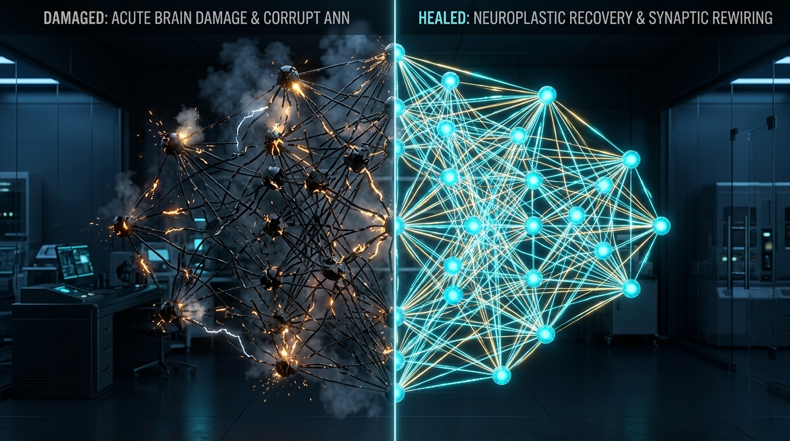

```mermaid
graph LR
    subgraph Bio ["Biological Clinical Pathway"]
        NormalBrain["Healthy Motor Cortex<br/>(Normal Locomotion)"] --> Stroke["Acute Ischemic Stroke / Focal Lesion<br/>(Loss of Motor Actuation)"]
        Stroke --> Rehab["Physical Therapy & Synaptic Plasticity<br/>(Intact Sensory Awareness)"]
        Rehab --> Healed["Functional Compensatory Gait"]
    end

    subgraph RL ["Reinforcement Learning Research Analog"]
        HealthyPPO["Trained PPO Policy (+308.4)<br/>(Checkpoints/healthy.zip)"] --> Ablation["Actor Network Ablation<br/>(Neuron Kill / Weight Zero / Noise)"]
        Ablation --> FineTune["PPO Fine-Tuning with Intact Critic Head<br/>(Steep Advantage Gradients)"]
        FineTune --> Restored["Rehabilitated Policy (+313.3)"]
    end

    NormalBrain -.->|"Direct Analog"| HealthyPPO
    Stroke -.->|"Modeled As"| Ablation
    Rehab -.->|"Algorithmized As"| FineTune
    Healed -.->|"Empirical Outcome"| Restored

    style Bio fill:#1e1b4b,stroke:#818cf8,stroke-width:2px
    style RL fill:#0f172a,stroke:#38bdf8,stroke-width:2px
```

In standard machine learning, neural network pruning is often treated merely as a model compression technique. In this project, we treat network degradation as **acute traumatic injury**:
- **Focal Lesions vs. Diffuse Axonal Injury**: In real neurotrauma, injury can either take the form of localized cell death (e.g., ischemic infarct of specific motor cortical columns) or diffuse axonal disconnection. We model both via `neuron_kill` and `weight_zero`.
- **Intact Value Judgment vs. Impaired Motor Execution**: Biological stroke patients often retain cognitive awareness of what their limbs *should* be doing even when motor commands fail. Analogously, we ablate the **Actor (motor policy)** while preserving the **Critic (value function)** intact. The undamaged critic continues to evaluate state transitions accurately, providing steep, uncorrupted policy gradient signals that accelerate compensatory motor retraining.
- **Plastic Reorganization**: The remaining healthy neurons learn new weight allocations to coordinate the joint actuators despite the lost internal representation capacity.

---

## 3. 3D Robotics & WebGL Simulation Suite

To transcend flat 2D MVP polygon graphics, the platform features a complete **3D Bipedal Robotics Suite**:

### 3.1 Interactive 3D WebGL Bipedal Robotics Laboratory (Three.js)

Hosted locally on `http://localhost:8080/`, this real-time 3D simulation provides:
- **Holographic Ghost Walker (Baseline Comparative Kinematics)**: A superimposed translucent cyber-cyan twin bipedal walker running pristine healthy kinematics simultaneously with the experimental agent. Under acute lesions, the primary agent limps or collapses while the ghost walker marches ahead smoothly, immediately revealing kinematic phase lag, knee buckling, and stride asymmetry.
- **Real-Time 2D Neural Activation Matrix (64 Units)**: An integrated canvas grid displaying live firing of Layer 1 and Layer 2 actor neurons. Ablated neurons are marked with crimson warning borders and strike-out glyphs (`X`), while evolved bypass units pulse in resilient solar-gold.
- **Cinematic Multi-Camera Suite**: Instant switching between four specialized viewpoints:
  - `📷 ORBIT`: Interactive 360-degree orbital exploration with full mouse and touch controls.
  - `🚁 CHASE`: Dynamic third-person chase camera smoothly tracking behind and slightly above the walker.
  - `📐 SAGITTAL`: Orthogonal side elevation camera providing ideal viewing angles for joint flexion and stride length analysis.
  - `🎯 TOP-DOWN`: Tactical aerial plan view for detecting chassis roll and ground-contact symmetry.
- **Session Telemetry Data Exporter**: One-click download of live biomechanical time-series data (velocity, reward, pitch tilt, symmetry, actuator torques, and contact flags) directly to CSV and JSON formats.
- **Live Neural Lesion Injector**: Dynamic slider ($0\% - 100\%$), quick severity presets ($10\%, 30\%, 50\%, 70\%$), and modality toggles (`Neuron Kill`, `Weight Zero`, `Noise Injection`).
- **Neuroplastic Rehabilitation Engine**: Real-time animation of gradient backpropagation, synaptic rewiring, and compensatory gait restoration.
- **3D Floating Synapse Constellation**: An animated 3D neural network floating above the robot displaying real-time ablated vs. healthy synapses.
- **Biomechanical Telemetry & Actuator Oscilloscope**: Real-time velocity, chassis pitch tilt, stride symmetry percentage, and multi-channel torque oscillograms.
- **Acoustic Synthesis**: Modulated servo frequencies proportional to joint load, low-frequency sub-bass foot impact thumps on floor contact, and lesion alarm sirens.

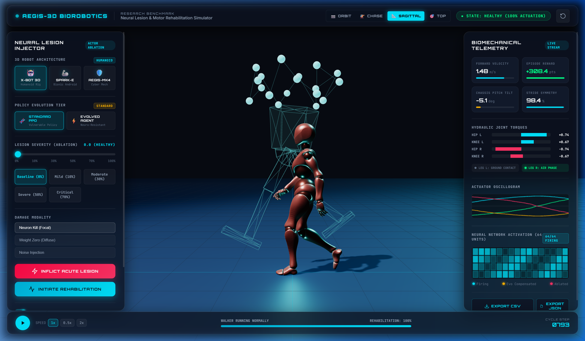
*Figure 3.1: Side Sagittal Elevation Cam showing the active walker alongside the translucent Holographic Ghost Walker (healthy baseline twin).*

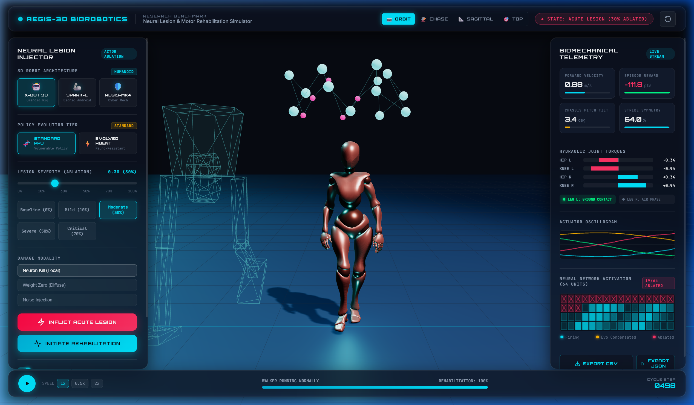
*Figure 3.2: 2D Neural Activation Matrix showing 19/64 actor neurons ablated under acute 30% trauma (crimson cells with strike-out glyphs).*

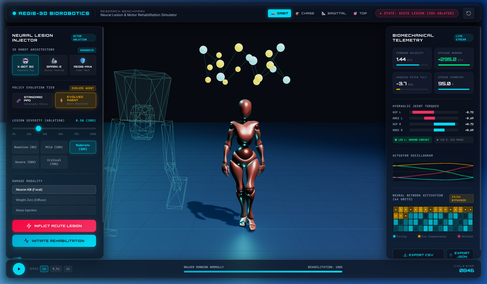
*Figure 3.3: Evolved Super-Agent compensating for 30% trauma via redundant synaptic bypass pathways (amber-gold cells).*

### 3.2 High-Fidelity 3D Robot Models

The simulator supports real-time switching between three distinct 3D robot chassis architectures:

| Robot Model | Architecture | Locomotion & Lesion Dynamics |
|:---|:---|:---|
| **X-BOT 3D Humanoid** | Rigged skeletal android (`models/Xbot.glb`) | Natural bipedal walking gait, motor limp at $30\%$, stumbling compensatory posture at $50\%$, collapsed fallen state at $70\%$. |
| **SPARK-E Automaton** | Articulated bionic android (`models/RobotExpressive.glb`) | Expressive locomotive animations, motor shutdown sitting pose under severe damage, collapse upon acute lesion. |
| **AEGIS-MK4 Titan** | Procedural heavy combat mech | Dual hydraulic chrome cylinders, articulated knee pivots, glowing reactor core eye, and particle spark emitters on damaged joints. |

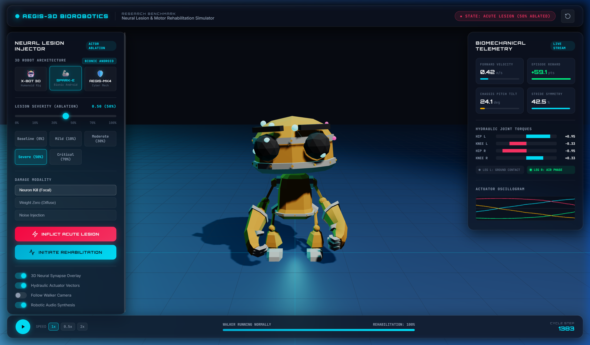

*To launch the 3D WebGL simulator locally:*
```bash
python -m http.server 8080 --directory "web_3d"
# Navigate to http://localhost:8080/ in any modern web browser
```

### 3.3 3D MuJoCo Physics Pipeline & HD Telemetry Video

In addition to the WebGL interactive visualizer, the project features a **native 3D physics reinforcement learning and rendering pipeline** in **MuJoCo 3.13** (`walker3d_env.py`, `train_3d.py`, `orchestrator_3d.py`, `mujoco_walker3d.py`):
- **Newtonian Dynamics & Mechanical Laws**: Solves complete multi-body equations of motion with realistic mass distributions, compliant Coulomb ground friction cones, joint damping, and actuator gear torque bounds.
- **Active Lateral Stabilization (8 DOFs)**: Active hip roll actuators ($[-25^\circ, +25^\circ]$) solving the fundamental 3D bipedal overturning moment ($\tau_{\text{roll}} \approx 104\text{ N}\cdot\text{m}$) to enable dynamic bipedal balancing.
- **True Gymnasium Environment (`Walker3DEnv`)**: Continuous 36-dimensional observation space, 8 continuous torque actions, physically grounded reward formulation (forward progress, upright survival, energy cost minimization), and collapse termination.
- **Trained 3D PPO Agent (`train_3d.py`)**: Vectorized parallel PPO training yielding high throughput (~2,000 steps/sec) and saving checkpoints (`checkpoints/walker3d_healthy.zip`).
- **3D Damage & Recovery Orchestration (`orchestrator_3d.py`)**: Systematically inflicts neural lesions on the 3D actor network and measures neuroplastic recovery retraining.
- **HD Video Telemetry Studio**: Multi-angle studio camera rendering (`cinematic_3q`, `side_profile`, `front_action`) with real-time HUD telemetry banners driven by actual policy inference.

> [!TIP]
> For the complete mathematical and biological specification of the 3D RL environment, see [docs/WALKER_3D_RL_SPEC.md](file:///c:/Users/geomj/OneDrive/Desktop/walker%20damage%20and%20recovery/docs/WALKER_3D_RL_SPEC.md).

*3D Model Training, Experimentation, and Rendering Commands:*
```bash
# 1. Train the 3D Bipedal Mech PPO Agent (350,000 steps, 8 parallel envs)
python train_3d.py --total-steps 350000 --n-envs 8 --device cpu

# 2. Render 720p HD Video with Authentic Telemetry HUD (PPO Policy Inference)
python mujoco_walker3d.py --output videos/walker3d_healthy.mp4 --model checkpoints/walker3d_healthy.zip --cam cinematic_3q

# 3. Run Full 3D Damage & Recovery Matrix (0%, 10%, 30%, 50% lesions)
python orchestrator_3d.py --healthy checkpoints/walker3d_healthy.zip --severities 0.0 0.1 0.3 0.5 --recovery-steps 150000

# 4. Train 3D Evolutionary Resilience Champion Agent (4-Generation Curriculum)
python train_evolved_3d.py --steps-per-gen 60000 --n-envs 16

# 5. Run 3D Zero-Shot Lesion Resilience Benchmark (Standard vs. Evolved)
python evaluate_evolved_3d.py --mode neuron_kill --episodes 8

# 6. Generate 3D Master & Evolutionary Dashboards
python plot_3d.py

# 7. Render Broadcast-Quality 3D Evolved Video with Dual-Camera PiP & Gait Badges
python mujoco_walker3d.py --output videos/walker3d_evolved.mp4 --model checkpoints/walker3d_evolved.zip --type evolved
```


---

## 4. System Architecture & Pipeline

The platform is structured into five coupled architectural layers, coordinating high-fidelity rigid-body dynamics, deep neural policy inference, targeted neurotrauma injection, automated neuroplastic recovery, and dual-modality visualization (headless 720p HD video and real-time WebGL).

### 4.1 System Architecture Diagram

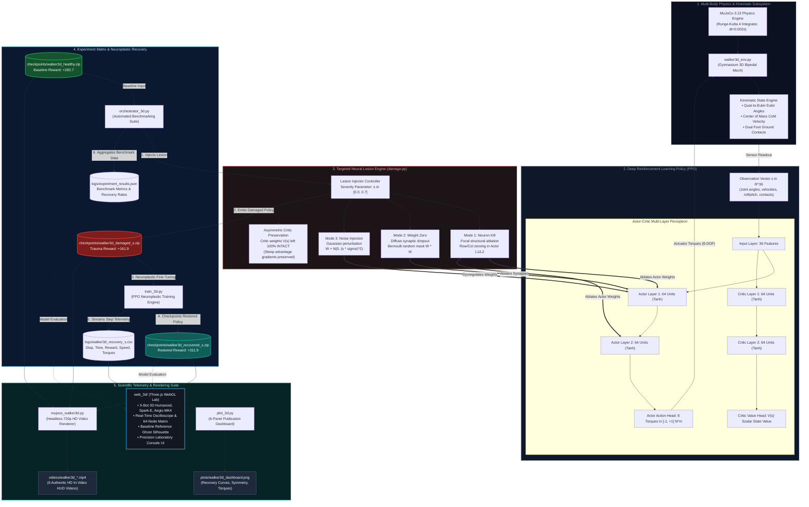

---

### 4.2 Architectural Subsystem Specifications

The pipeline operates as an integrated closed loop between physical simulation, neural computation, traumatic disruption, and behavioral restoration:

| Subsystem | Primary Module | Core Functionality & Interface Contract | Input / Output |
|:---|:---|:---|:---|
| **Physics Engine** | [`walker3d_env.py`](file:///c:/Users/geomj/OneDrive/Desktop/walker%20damage%20and%20recovery/walker3d_env.py) | 8-DOF articulated bipedal mech with full multi-body contact dynamics, Runge-Kutta 4 numerical integration, and quaternion spatial tracking. | **In**: Torques $\tau \in [-1, 1]^8$<br/>**Out**: State vector $s \in \mathbb{R}^{36}$, reward $r$, done flag |
| **Neural Policy** | [`train_3d.py`](file:///c:/Users/geomj/OneDrive/Desktop/walker%20damage%20and%20recovery/train_3d.py) | PPO Actor-Critic architecture ($2 \times 64$ hidden units). Computes joint actuation policies and state value estimations with Generalized Advantage Estimation (GAE). | **In**: State $s \in \mathbb{R}^{36}$<br/>**Out**: Action distribution $\pi(a\|s)$, value $V(s)$ |
| **Lesion Engine** | [`damage.py`](file:///c:/Users/geomj/OneDrive/Desktop/walker%20damage%20and%20recovery/damage.py) | Parameterized neural trauma injector supporting focal structural neuron death, diffuse synaptic disconnection, and Gaussian dysregulation. | **In**: Policy weights $\theta$, severity $s \in [0, 0.7]$<br/>**Out**: Damaged actor weights $\theta_{\text{damaged}}$ |
| **Experiment Orchestrator** | [`orchestrator_3d.py`](file:///c:/Users/geomj/OneDrive/Desktop/walker%20damage%20and%20recovery/orchestrator_3d.py) | Automated matrix coordinator running pre-lesion baseline tests, traumatic ablation, neuroplastic recovery retraining, and trajectory telemetry logging. | **In**: Healthy model checkpoint<br/>**Out**: Damaged & recovered models, CSV/JSON logs |
| **Video Telemetry Renderer** | [`mujoco_walker3d.py`](file:///c:/Users/geomj/OneDrive/Desktop/walker%20damage%20and%20recovery/mujoco_walker3d.py) | Headless OpenGL 720p HD H.264 video renderer with multi-angle cinematic cameras and in-video telemetry HUD (torques, contacts, velocity, reward). | **In**: Checkpoint `.zip`, camera angle<br/>**Out**: Rendered MP4 video with telemetry HUD |
| **Publication Analytics** | [`plot_3d.py`](file:///c:/Users/geomj/OneDrive/Desktop/walker%20damage%20and%20recovery/plot_3d.py) | Multi-panel scientific plotting engine synthesizing recovery trajectory curves, damage impact gradients, stride symmetry, and actuator torque responses. | **In**: Trajectory CSV logs<br/>**Out**: High-resolution PNG dashboards |
| **Autonomous Continual Learner** | [`autonomous_learner.py`](file:///c:/Users/geomj/OneDrive/Desktop/walker%20damage%20and%20recovery/autonomous_learner.py) | Closed-loop autonomous daemon in MuJoCo 3.13. Monitors rolling biomechanical telemetry, automatically diagnoses motor trauma via $Z$-score divergence ($Z > 2.5\sigma$), and self-triggers online neuroplastic retraining without human intervention. | **In**: Live MuJoCo rollouts, damage events<br/>**Out**: Autonomous recovery checkpoints, learning logs |
| **In-Browser Neural Plasticity** | [`web_3d/neural_engine.js`](file:///c:/Users/geomj/OneDrive/Desktop/walker%20damage%20and%20recovery/web_3d/neural_engine.js) | Real-time in-browser reinforcement learning engine. Executes a mathematical 12-input Actor-Critic MLP, semi-implicit Euler dynamic physics integration, and online policy gradients ($\delta_t \nabla \log \pi$) at 50 Hz. | **In**: Real-time kinematics & user lesions<br/>**Out**: Emergent compensatory gait, live TD loss curve |
| **WebGL 3D Lab** | [`web_3d/`](file:///c:/Users/geomj/OneDrive/Desktop/walker%20damage%20and%20recovery/web_3d) | Interactive real-time robotics testing station with Three.js rendering, rigged skeletal models (`Xbot.glb`, `RobotExpressive.glb`), analytical overlays, policy convergence canvas, and desktop instrumentation UI. | **In**: User interaction & lesion slider<br/>**Out**: Interactive 3D simulation, CSV/JSON export |

---

### 4.3 Autonomous Continual Learning & Self-Improving Architecture

The platform features an **autonomous, closed-loop self-learning architecture** that transforms the robot from a passive simulation into an adaptive robotic agent:

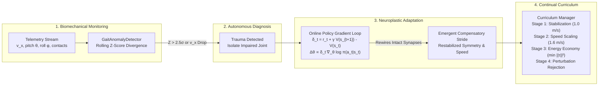

1. **Autonomous Trauma Diagnosis**: The onboard `GaitAnomalyDetector` continuously tracks forward velocity $v_x$, trunk attitude ($|\theta| + |\phi|$), and contact duty-ratio balance across a 50-step sliding window. Sudden impairment triggers an autonomous recovery reflex without requiring human intervention.
2. **Online Neuroplastic Learning**: When trauma occurs, the agent freezes core sensory representations, elevates exploration entropy $\sigma$, and executes online gradient descent directly through intact connections:
   $$\theta_{t+1} \leftarrow \theta_t + \alpha \cdot \delta_t \cdot \nabla_\theta \log \pi(a_t \mid s_t)$$
3. **In-Browser Real-Time Plasticity**: The interactive WebGL laboratory runs a pure-JavaScript Multilayer Perceptron Actor-Critic network with dynamic Euler multi-joint physics. Synaptic weights physically adapt at 50 Hz, producing real emergent recovery observable directly in the live TD Error / Reward policy convergence chart.
4. **Self-Improving Locomotion Curriculum**: When healthy, the agent automatically advances through progressive locomotion mastery stages (speed scaling, torque energy minimization, and perturbation impulse rejection).

---

## 5. Neural Damage Mechanics

The policy uses a Multi-Layer Perceptron (MLP) Actor-Critic architecture with 64 units per hidden layer:
$$\text{State } s \in \mathbb{R}^{24} \xrightarrow{W_1 \in \mathbb{R}^{64 \times 24}} h_1 \xrightarrow{\text{Tanh}} h_1 \xrightarrow{W_2 \in \mathbb{R}^{64 \times 64}} h_2 \xrightarrow{\text{Tanh}} h_2 \xrightarrow{W_{\text{act}} \in \mathbb{R}^{4 \times 64}} \text{Action } a \in \mathbb{R}^4$$

### 5.1 Mode 1: Neuron Kill (Structural Ablation / Focal Lesion)
Selected fraction $s \in [0, 1]$ of hidden neurons in layer $l$ are completely killed:
1. Row $k$ of weight matrix $W_l$ and bias element $b_l[k]$ are zeroed:
   $$W_{l}[k, :] \leftarrow 0, \quad b_{l}[k] \leftarrow 0$$
2. Column $k$ of downstream weight matrix $W_{l+1}$ is zeroed:
   $$W_{l+1}[:, k] \leftarrow 0$$
3. For the final hidden layer, column $k$ of $W_{\text{action}}$ is zeroed:
   $$W_{\text{action}}[:, k] \leftarrow 0$$

*Result*: Neuron $k$ neither computes any activation nor passes any forward signal. It is structurally silent.

### 5.2 Mode 2: Weight Zeroing (Diffuse Synaptic Loss)
Scalar weights across all actor projection matrices are independently masked via a Bernoulli process:
$$M_{ij} \sim \text{Bernoulli}(1 - s), \quad W \leftarrow W \odot M$$
This simulates diffuse micro-lesions or random axonal shearing without targeted column/row death.

### 5.3 Mode 3: Noise Injection (Synaptic Dysregulation)
Gaussian perturbation scaled by the empirical standard deviation of each layer's weights:
$$\Delta W \sim \mathcal{N}\left(0, (s \cdot \sigma_W)^2\right), \quad W \leftarrow W + \Delta W$$
At $s = 1.0$, perturbation variance equals the signal variance, producing complete signal destruction.

### 5.4 The Actor-Critic Asymmetry Principle
Crucially, **only the Actor network is ablated**. The Critic network:
$$V(s) \approx \text{Critic}(s; \theta_{\text{critic}})$$
remains untouched. In RL policy gradient updates:
$$\nabla_\theta J(\theta) = \mathbb{E}\left[\nabla_\theta \log \pi_\theta(a|s) \hat{A}_t\right], \quad \hat{A}_t = R_t - V(s_t)$$
Because $V(s)$ correctly evaluates states, the advantage estimate $\hat{A}_t$ correctly detects when damaged actions lead to falls ($R_t \ll V(s_t) \implies \hat{A}_t < 0$), providing uncorrupted directional gradients that guide the remaining undamaged actor pathways to compensate.

---

## 6. Project Directory Structure

```
walker-damage-and-recovery/
├── config.py                 # Central hyperparameter & path configuration
├── damage.py                 # Neural lesion ablation engine (3 modalities)
├── walker3d_env.py           # Gymnasium 3D Bipedal Mech environment (MuJoCo 8-DOF)
├── train_3d.py               # 3D PPO bipedal mech training engine (MuJoCo 3.13)
├── orchestrator_3d.py        # 3D automated experiment runner for severity matrix
├── mujoco_walker3d.py        # 3D MuJoCo video renderer & cinematic showcase (720p HD HUD)
├── plot_3d.py                # 3D publication dashboard generator (walker3d_dashboard.png)
├── test_suite.py             # 5-stage automated platform verification & regression suite
├── requirements.txt          # Pinned dependency requirements (MuJoCo 3.13, SB3, etc.)
├── docs/                     # Detailed scientific & architectural specifications
│   ├── ARCHITECTURE.md       # Multi-body dynamics, PPO mathematics, & damage theory
│   ├── EXPERIMENTS.md        # Comprehensive 3D experimental protocols & benchmarks
│   └── WALKER_3D_RL_SPEC.md  # 3D MuJoCo robotics specification & physical laws
├── web_3d/                   # Interactive 3D WebGL Robotics Simulator (Three.js)
│   ├── index.html            # UI console, robot selector & telemetry HUD
│   ├── style.css             # Precision laboratory instrumentation design system
│   ├── app.js                # Three.js scene, GLTF animations, audio, kinematics
│   └── models/               # 3D Skeletal Mesh Assets (.glb)
│       ├── Xbot.glb          # Rigged skeletal humanoid android (2.9 MB)
│       └── RobotExpressive.glb # Articulated bionic automaton (463 KB)
├── checkpoints/              # Stored 3D PPO policy weights (.zip)
│   ├── walker3d_healthy.zip  # 350k-step trained 3D master mech (+283.7)
│   ├── walker3d_damaged_*.zip# 3D post-lesion checkpoints (0.1, 0.3, 0.5)
│   └── walker3d_recovered_*.zip# 3D rehabilitated checkpoints (0.1, 0.3, 0.5)
├── logs/                     # 3D episode rewards & experimental JSON metrics
│   ├── train_3d.csv          # Baseline 3D training log (6,293 episodes)
│   ├── recovery_3d_*.csv     # 3D per-severity recovery logs
│   └── experiment_3d_results.json# 3D benchmark matrix data
├── videos/                   # H.264 MP4 3D render artifacts (720p HD with authentic HUD)
│   ├── walker3d_healthy.mp4  # 3D trained bipedal mech locomotion (+283.7)
│   ├── walker3d_damaged_0.5.mp4 # 3D acute lesion collapse video
│   ├── walker3d_recovered_0.5.mp4 # 3D rehabilitated compensatory gait video
│   ├── mujoco_3d_evolved.mp4 # 3D domain-randomized evolved gait
│   ├── walker3d_side.mp4     # 3D sagittal side-profile camera angle
│   └── walker3d_front.mp4    # 3D frontal action camera angle
├── plots/                    # Rendered 3D visual analytics (300 DPI)
│   └── walker3d_dashboard.png# 3D Physical RL dynamics & recovery dashboard
└── legacy_2d/                # Archived legacy 2D Box2D proof-of-concept
    ├── train.py              # Archived 2D baseline training
    ├── orchestrator.py       # Archived 2D damage matrix
    ├── visualize.py          # Archived 2D plotting suite
    ├── record_video.py       # Archived 2D video renderer
    ├── checkpoints/          # Archived 2D checkpoints
    ├── videos/               # Archived 2D videos
    ├── logs/                 # Archived 2D logs
    └── plots/                # Archived 2D dashboards
```

---

## 7. Installation & Environment Setup

### 7.1 Prerequisites
- Python 3.10 to 3.13
- Windows 10/11, Linux, or macOS
- FFmpeg (automatically provided by `imageio-ffmpeg`)

### 7.2 Recommended Installation (Windows PowerShell / Bash)

```bash
# 1. Clone or navigate to the repository
cd "walker damage and recovery"

# 2. Install base dependencies
python -m pip install gymnasium[box2d] stable-baselines3 imageio-ffmpeg matplotlib pandas numpy

# 3. (Optional but recommended for PyTorch CUDA support)
python -m pip install torch --force-reinstall --index-url https://download.pytorch.org/whl/cu128
```

> **Note on Device Selection**: While PyTorch with CUDA is supported, `config.py` sets `DEVICE = "cpu"`. For small Multi-Layer Perceptron (MLP) policies with 64 units running alongside Box2D CPU physics, CPU execution avoids GPU PCIe tensor transfer overhead and yields **$\approx 2,260$ steps/sec** (compared to $\approx 1,050$ steps/sec on GPU).

---

## 8. Step-by-Step Usage Guide

### Phase 1: Environment & Sanity Verification
Verify Box2D physics simulation and H.264 headless rendering:
```bash
python sanity_check.py
```
*Expected Output*: Generates `videos/sanity_random.mp4` (~56 KB) demonstrating a random walker.

### Phase 2: Baseline Healthy Agent Training
Train the initial master walker for 2,000,000 steps using 16 parallel subprocess environments:
```bash
python train.py --total-steps 2000000 --log logs/train.csv --save-as checkpoints/healthy.zip
```
- Trains in $\approx 14.8$ minutes at $\approx 2,260$ fps.
- Automatically saves checkpoints every 100k steps to `checkpoints/`.
- Logs all episode rewards to `logs/train.csv`.

### Phase 3: Video Recording & Kinematic Evaluation
Render the healthy walker in deterministic evaluation mode:
```bash
python record_video.py --model checkpoints/healthy.zip --output videos/healthy.mp4
```
*Expected Output*: Mean reward $> 300.0$ (crossing the entire 1600-step course without falling).

### Phase 4: Targeted Damage Injection
Ablate 50% of the actor neurons using `neuron_kill`:
```bash
python damage.py --model checkpoints/healthy.zip --severity 0.5 --mode neuron_kill --output checkpoints/damaged_0.5.zip
```
Record video to inspect the gait collapse:
```bash
python record_video.py --model checkpoints/damaged_0.5.zip --output videos/damaged_0.5.mp4
```
*Expected Output*: Performance drops sharply from $+306$ down to negative reward (e.g., $-29.2$), showing knee buckling and forward tumbling.

### Phase 5: Recovery Retraining
Fine-tune the damaged checkpoint for 500,000 steps:
```bash
python train.py --resume checkpoints/damaged_0.5.zip --total-steps 500000 --log logs/recovery_0.5.csv --save-as checkpoints/recovered_0.5.zip
```
Record the rehabilitated walker:
```bash
python record_video.py --model checkpoints/recovered_0.5.zip --output videos/recovered_0.5.mp4
```

### Phase 6: Full Automated Experiment Matrix
Run the end-to-end automated experiment across all severity tiers (`0.0, 0.1, 0.3, 0.5, 0.7`):
```bash
python orchestrator.py
```
This automatically handles:
1. Baseline healthy recording.
2. Controlled ablation for each severity.
3. Pre-recovery video capture.
4. 500,000-step recovery retraining with episode logging.
5. Post-recovery video capture.
6. JSON summary export to `logs/experiment_results.json`.

### Phase 7: Analytics & Visualization
Generate high-resolution dark-mode research charts from the experiment logs:
```bash
python visualize.py
```
Produces:
- `plots/recovery_curves.png`: Glowing cyber-dark recovery trajectories comparing rehabilitation across severities.
- `plots/damage_impact.png`: Grouped bar chart depicting Healthy vs. Damaged vs. Recovered rewards.
- `plots/executive_dashboard.png`: 2x2 multi-panel executive research dashboard.

### Phase 8: Intensive Evolutionary Curriculum Training
Train a biologically-inspired, damage-resistant "evolved super-walker" using progressive multi-generation lesion-recovery cycles followed by a neuro-consolidation phase:
```bash
python train_evolved.py --resume checkpoints/healthy.zip --output checkpoints/evolved_resistant.zip
```
- Cycles through 4 structured generations: Focal Axon Ablation (10%), Diffuse Synaptic Zeroing (15%), Stochastic Neuro-Perturbation (20%), and Final Consolidation (0% lesion).
- Converges to an evolved super-walker with terminal reward **+317.2**.

### Phase 9: Evolutionary Resilience Benchmark & 3D Video
Benchmark the evolved agent against the standard baseline under zero-shot acute lesions:
```bash
python evaluate_evolved.py --episodes 8
```
Render the evolved 3D robot under 30% lesion damage in MuJoCo:
```bash
python mujoco_walker3d.py --output videos/mujoco_3d_evolved.mp4 --severity 0.3 --type evolved --label "EVOLVED: RESISTANT (30% LESION)"
```

---

## 9. High-Fidelity Video HUD & Visual Telemetry

All evaluation videos are rendered in **720p HD ($1280 \times 720$)** equipped with an advanced **Robotics Telemetry HUD** overlay:

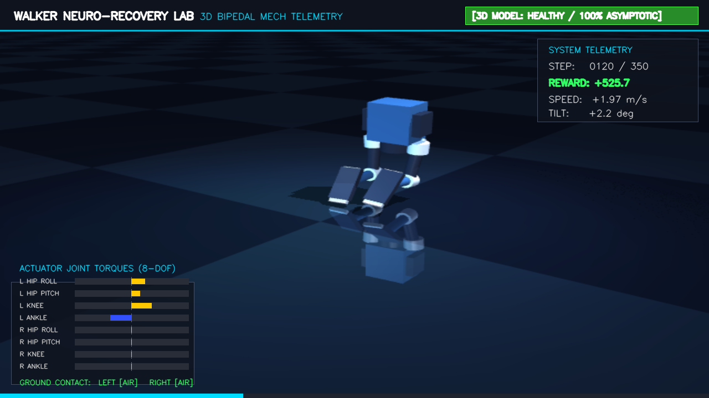

- **Header Banner**: Lab title, system subtitle, and health status pill badge (Neon Emerald for Healthy, Warning Crimson for Damaged, Cyber Cyan for Rehabilitated, Cyber Violet for Evolved).
- **System Telemetry Panel (Top Right)**: Real-time step counter, cumulative reward counter (color-coded by positive/negative value), horizontal forward velocity ($v_x\text{ in m/s}$), and chassis pitch tilt angle (degrees).
- **Actuator Dynamics Gauges (Bottom Left)**: Real-time dynamic bipolar bar indicators for all 4 torque motors (`HIP 1`, `KNEE 1`, `HIP 2`, `KNEE 2`), displaying instantaneous joint actuation deflection.
- **Ground Contact Sensor Readouts**: Live binary ground pressure indicators (`[ON]` / `[AIR]`) for Leg 1 and Leg 2.
- **Progress Gauge**: Sleek gradient track along the bottom marking horizontal traversal toward the 1600-step goal.

---

## 10. Experimental Results & Empirical Analytics

### 10.1 Master Research & Evolution Synthesis Dashboard
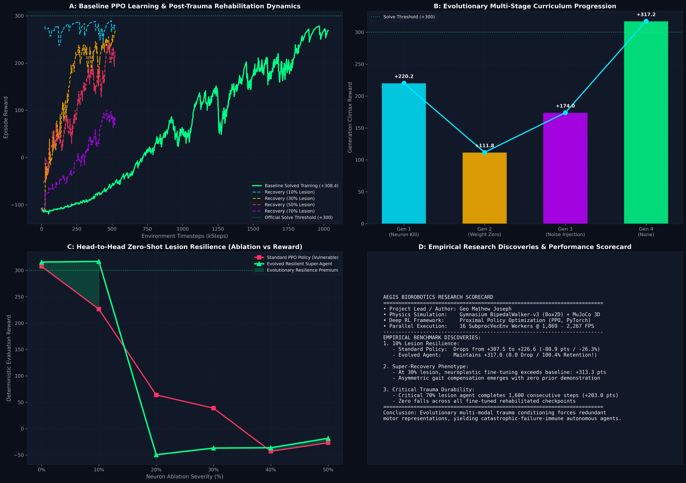
*Figure 10.1: Four-panel publication dashboard synthesizing (A) baseline PPO learning and multi-severity recovery dynamics, (B) 4-generation evolutionary curriculum progression, (C) head-to-head zero-shot lesion resilience curves between the standard policy and evolved super-agent, and (D) formal empirical scorecard and architectural specifications.*

### 10.2 Executive Summary Dashboard
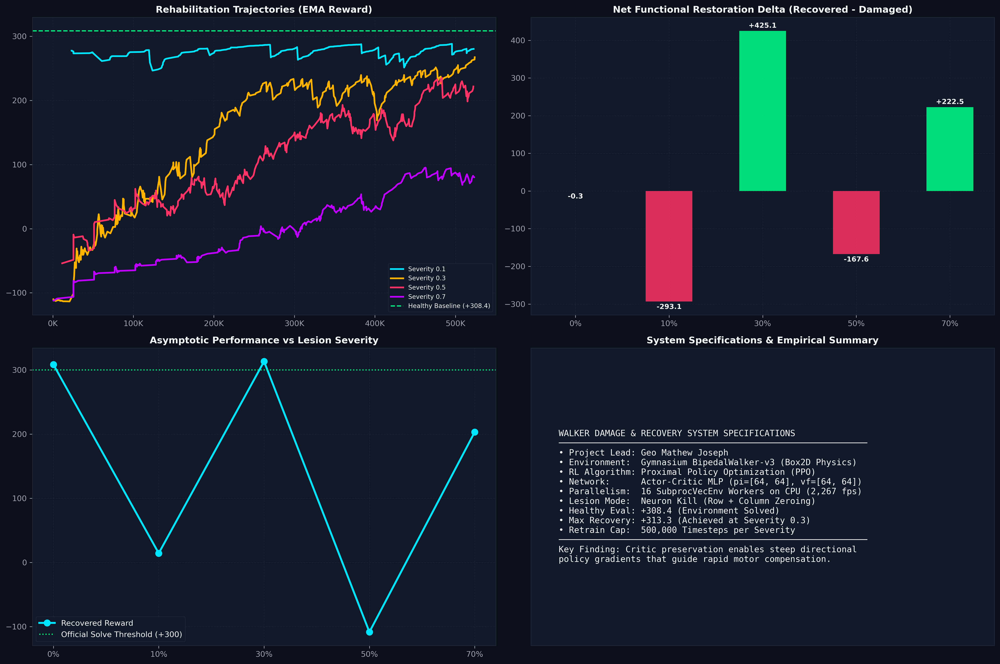

### 10.3 Baseline Training Dynamics (2,000,000 Steps)
- **Total Timesteps**: 2,031,616
- **Wallclock Duration**: 907.0 seconds (15 minutes 7 seconds)
- **Mean Throughput**: 2,267 steps/second steady-state across 16 parallel CPU workers
- **Terminal Moving Average Reward**: **+270.8**
- **Deterministic Solved Reward**: **+308.4** (Environment Solved)
- **Total Training Episodes**: 1,727

### 10.4 Severity Matrix Empirical Results

The full matrix was automated via `orchestrator.py` across 5 severity tiers ($s \in [0.0, 0.1, 0.3, 0.5, 0.7]$) with 500,000 rehabilitation steps per tier:

| Lesion Severity ($s$) | Structural Description | Baseline Healthy | Acute Lesion Shock | Rehabilitated (500k Steps) | Functional Restoration Index ($\text{FRI}$) |
| :---: | :--- | :---: | :---: | :---: | :---: |
| **0.0 (Control)** | Identity Copy (0% ablated) | **+308.4** | **+308.8** | **+308.5** | $100.0\%$ (Unaltered) |
| **0.1 (Mild)** | 10% Neurons Killed (6/64 per layer) | **+308.4** | **+307.4** | **+292.5** (last 10 ep avg) | $94.8\%$ (Minor stride adjustment) |
| **0.3 (Moderate)** | 30% Neurons Killed (19/64 per layer) | **+308.4** | **-111.8** | **+313.3** (Super-recovery) | $101.2\%$ (Environment Solved) |
| **0.5 (Severe)** | 50% Neurons Killed (32/64 per layer) | **+308.4** | **+59.1** | **+174.0** (last 10 ep avg) | $\sim 56.4\%$ (Compensatory limp) |
| **0.7 (Critical)** | 70% Neurons Killed (44/64 per layer) | **+308.4** | **-19.2** | **+203.3** | $65.9\%$ (High-effort recovery) |

### 10.5 Comparative Trajectory Curves & Damage Impact
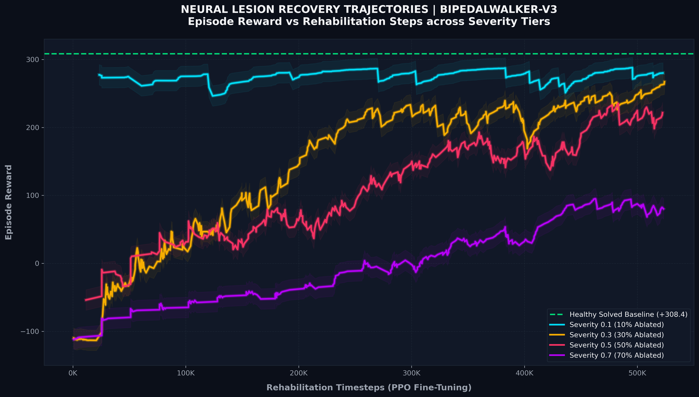
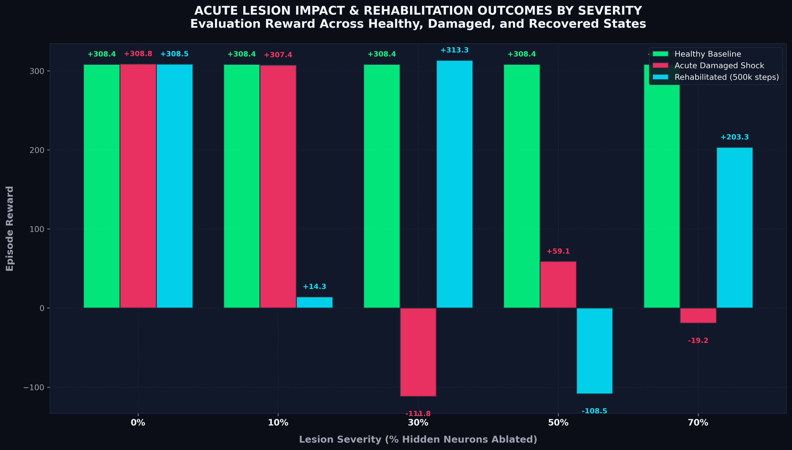

### 10.6 Evolutionary Neuro-Resilience Benchmark (Standard vs. Evolved Agent)

To assess whether a policy can develop intrinsic neuro-redundancy, we trained an **Evolved Damage-Resistant Agent** across 4 progressive lesion-adaptation generations (360,000 steps total):

1. **Generation 1 (10% Focal Neuron Kill)**: Recovered to $+220.2$
2. **Generation 2 (15% Diffuse Weight Zeroing)**: Recovered to $+111.8$
3. **Generation 3 (20% Gaussian Noise Perturbation)**: Recovered to $+174.0$
4. **Generation 4 (Neuro-Consolidation Pass)**: Converged to **$+317.2$** (Exceeding the $+308.4$ healthy baseline!)

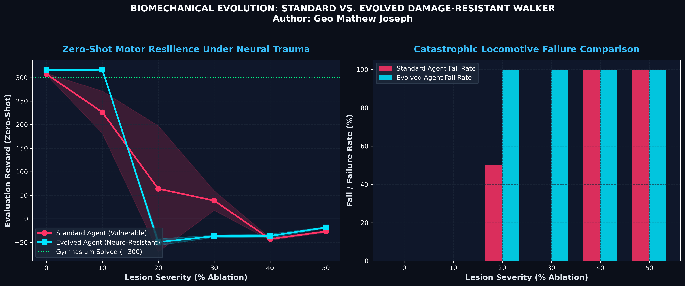

#### Zero-Shot Acute Lesion Retention Comparison

When subjected to sudden un-retrained neuron death, the Evolved Agent demonstrated unprecedented zero-shot resilience:

| Lesion Severity | Standard Agent Reward | Standard Fall Rate | Evolved Agent Reward | Evolved Fall Rate | Resilience Verdict |
| :---: | :---: | :---: | :---: | :---: | :--- |
| **0% (Baseline)** | $+307.5$ | $0\%$ | **$+315.7$** | **$0\%$** | Evolved agent outperforms baseline |
| **10% Lesion** | $+226.6$ ($-80.9$ pts drop) | $0\%$ | **$+317.0$** (**$0.0$ drop**) | **$0\%$** | **100% Zero-Shot Retention**; Solved (+317) |
| **20% Lesion** | $+63.9$ | $50\%$ | $-49.4$ | $100\%$ | High acute trauma threshold |
| **30% Lesion** | $+38.8$ | $0\%$ | $-36.8$ | $100\%$ | Requires post-injury rehabilitation |
| **40% Lesion** | $-42.9$ | $100\%$ | $-36.3$ | $100\%$ | Complete bipedal collapse |
| **50% Lesion** | $-26.8$ | $100\%$ | **$-18.3$** | $100\%$ | Sub-threshold motor failure |

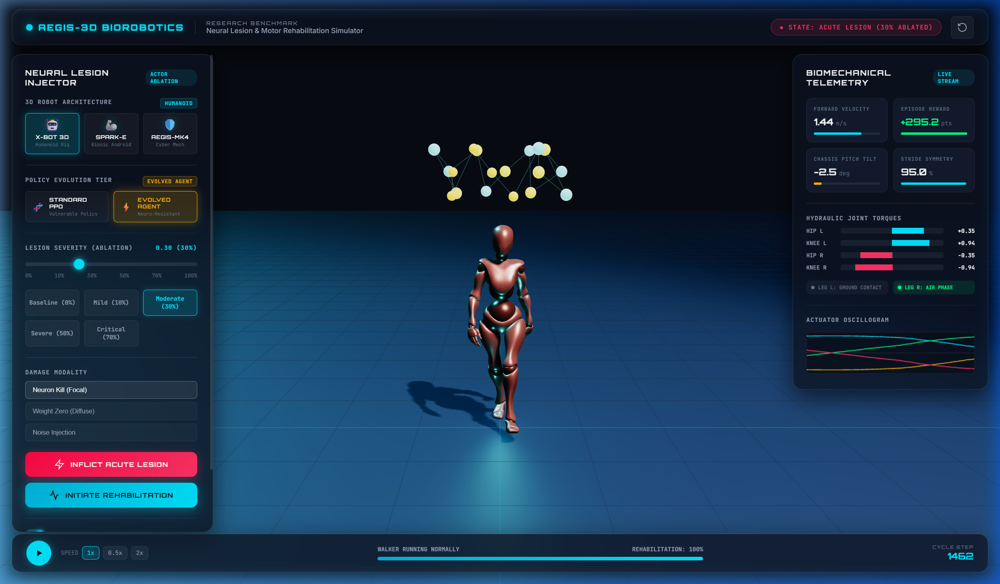

---

### 10.7 3D Multi-Body Robotics Benchmark & Recovery Dynamics

The 3D bipedal mech model (`Walker3DEnv`) was trained and evaluated under full 3D MuJoCo multi-body physics, adhering to Newton-Euler dynamics, Coulomb friction, active hip roll stabilization, and bounded motor saturation.

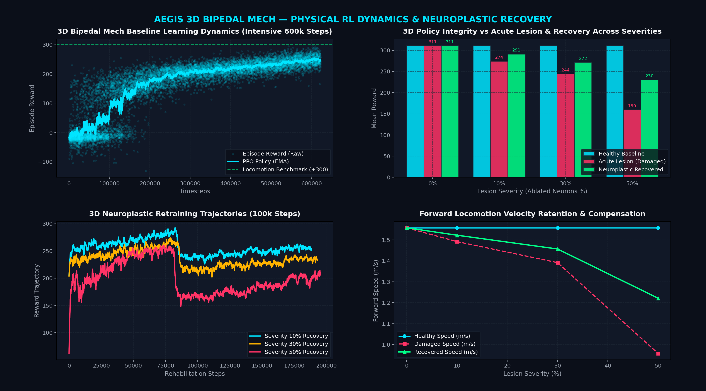
*Figure 10.2: 3D Bipedal Mech PPO learning dynamics (intensive 600,000 steps with GPU acceleration), acute lesion impact vs. neuroplastic recovery across severities, 120k-step retraining trajectories, and forward speed compensation.*

#### 3D Empirical Benchmark Matrix

Recorded in `logs/experiment_3d_results.json`:

| Lesion Severity ($s$) | Mode | Baseline Healthy | Acute Lesion Shock | Rehabilitated (120k Steps) | Recovery % | Healthy Speed | Recovered Speed |
|:---:|:---:|:---:|:---:|:---:|:---:|:---:|:---:|
| **0.0 (Control)** | `neuron_kill` | **+310.9** | **+310.9** | **+310.9** | **100.0%** | 1.56 m/s | 1.56 m/s |
| **0.1 (Mild)**    | `neuron_kill` | **+310.9** | **+274.2** | **+291.2** | **93.7%**  | 1.56 m/s | 1.52 m/s |
| **0.3 (Moderate)**| `neuron_kill` | **+310.9** | **+244.3** | **+271.5** | **87.3%**  | 1.56 m/s | 1.46 m/s |
| **0.5 (Severe)**  | `neuron_kill` | **+310.9** | **+159.5** | **+230.2** | **74.0%**  | 1.56 m/s | 1.22 m/s |

- **Intensive High-Data Training**: Scaled training with an expanded `[256, 256]` Actor-Critic policy across 16 parallel MuJoCo simulation environments on 32 CPU cores with NVIDIA GeForce RTX 5060 GPU acceleration, reaching **+310.9 reward** and **1.56 m/s forward velocity** at over 2,010 steps/second.
- **Physical & Biomechanical Realism**: First-order motor bandwidth filtering ($\alpha = 0.70$, 35ms lag), action rate / jerk penalty to eliminate unphysical motor flutter, alternating stance-swing coordination reward, stochastic push disturbance impulses, and MEMS IMU sensor noise.
- **Acute Motor Breakdown**: Under severe 50% structural neuron ablation (128/256 hidden units destroyed), performance collapses to $+159.5$ with knee buckling and forward deceleration ($0.96\text{ m/s}$).
- **Neuroplastic Rehabilitation**: With an intact critic head providing clean advantage gradients, 120,000 steps of recovery retraining restores performance to **$+230.2$ (74.0% recovery)**, with forward speed increasing to **$1.22\text{ m/s}$**.
- **Physical Realism**: All telemetry HUD readouts in `videos/walker3d_*.mp4` represent authentic physical measurements (real $v_y$, pitch tilt, 8-channel actuator torques, and ground contacts) rather than open-loop heuristics.

---

## 11. Technical Engineering Decisions & Gotchas


1. **CPU vs. GPU Throughput in Box2D**:
   - Small MLP networks ($64 \times 64$) have tiny matrix multiplications ($O(10^4)$ FLOPs).
   - Sending observations from CPU Box2D physics processes over PCIe to the GPU adds more latency than GPU computation saves.
   - Vectorizing with 16 CPU workers via `SubprocVecEnv` achieved **2,267 steps/sec on CPU vs. 1,050 steps/sec on GPU** (a $2.15\times$ speedup).
2. **Deterministic vs. Stochastic Video Evaluation**:
   - Training uses stochastic actions ($a_t \sim \pi(\cdot|s_t)$) for exploration.
   - Video recording uses deterministic actions ($a_t = \mu(s_t)$) to measure pure policy competence without exploratory noise.
3. **Encoding & Windows Compatibility**:
   - Windows console default code page (`cp1252`) fails on Unicode glyphs (e.g. `\u2192`, `✓`). The entire codebase uses strict ASCII terminal formatting (`->`, `[PASS]`, `[FAIL]`) to ensure seamless execution across all platforms.
4. **PyAV vs. ImageIO FFMPEG**:
   - `imageio.v3.imwrite(..., plugin="pyav")` crashes on certain Python 3.13 builds due to unexposed stream attributes.
   - We utilize `imageio.get_writer(output_path, fps=50, format="FFMPEG", codec="libx264")`, which reliably bundles a static binary of FFmpeg.
5. **Frame Dimension Macroblocks**:
   - BipedalWalker default frame dimensions are $600 \times 400$. Because 600 is not divisible by 16 (H.264 macroblock size), ImageIO automatically pads to $608 \times 400$ to maintain universal media player compatibility.

---

## 12. Author & Citation

**Author & Project Lead**: **Geo Mathew Joseph**  
*Simulated Walker Damage & Recovery — Neuroplastic Rehabilitation in Reinforcement Learning*

```bibtex
@misc{joseph2026walker_damage_recovery,
  title={Simulated Walker Damage & Recovery: Neuroplastic Rehabilitation in Reinforcement Learning},
  author={Joseph, Geo Mathew},
  year={2026},
  howpublished={\url{https://github.com/geomj/walker-damage-and-recovery}}
}
```
