# Technical Architecture & Theoretical Foundations

**Author**: **Geo Mathew Joseph**  
This document details the mathematical, biological, mechanical, and algorithmic underpinnings of the **Walker Damage & Recovery** research system, covering both the **2D Planar Locomotive Suite** (`BipedalWalker-v3`) and the **3D Multi-Body Robotics Suite** (`Walker3DEnv` in MuJoCo 3.13).

---

## 1. Dual-Domain Biomechanical Architecture

The platform operates across two complementary physical regimes:

```mermaid
graph TD
    subgraph Env2D ["2D Planar Kinematics (Box2D Physics)"]
        BW["BipedalWalker-v3 (Gymnasium)"]
        S2D["State Space S in R^24<br/>(Hull tilt, angular vel, v_x, v_y, joints, 10x LIDAR)"]
        A2D["Action Space A in [-1, 1]^4<br/>(Hip 1, Knee 1, Hip 2, Knee 2)"]
        PPO2D["PPO Actor-Critic: 24 -> [64, 64] -> 4"]
    end

    subgraph Env3D ["3D Multi-Body Dynamics (MuJoCo 3.13 Physics)"]
        W3D["Walker3DEnv (Gymnasium / MJCF)"]
        S3D["State Space S in R^36<br/>(z, roll, pitch, yaw, v_xyz, w_xyz, 8x joints, contacts)"]
        A3D["Action Space A in [-1, 1]^8<br/>(Dual Hip Roll, Hip Pitch, Knee, Ankle)"]
        PPO3D["PPO Actor-Critic: 36 -> [128, 128] -> 8"]
    end

    BW --> S2D --> PPO2D --> A2D --> BW
    W3D --> S3D --> PPO3D --> A3D --> W3D

    style Env2D fill:#0f172a,stroke:#38bdf8,stroke-width:2px
    style Env3D fill:#1e1b4b,stroke:#00ff88,stroke-width:2px
```

---

## 2. 2D Planar Formulation (`BipedalWalker-v3`)

### 2.1 State Space $\mathcal{S}_{2\text{D}} \subset \mathbb{R}^{24}$
The agent observes a continuous 24-dimensional observation vector at each timestep ($50\text{ Hz}$ physics simulation frequency):

| Index Range | Dim | Description | Physical Unit / Scale |
| :--- | :---: | :--- | :--- |
| `0` | 1 | Hull angle | Radians $\in [-\pi, \pi]$ |
| `1` | 1 | Hull angular velocity | $\text{rad/s}$ |
| `2` | 1 | Horizontal linear velocity | Scaled $v_x$ |
| `3` | 1 | Vertical linear velocity | Scaled $v_y$ |
| `4 - 5` | 2 | Hip 1 (angle, angular velocity) | Rad, $\text{rad/s}$ |
| `6 - 7` | 2 | Knee 1 (angle, angular velocity) | Rad, $\text{rad/s}$ |
| `8` | 1 | Leg 1 ground contact flag | Boolean $\in \{0, 1\}$ |
| `9 - 10` | 2 | Hip 2 (angle, angular velocity) | Rad, $\text{rad/s}$ |
| `11 - 12` | 2 | Knee 2 (angle, angular velocity) | Rad, $\text{rad/s}$ |
| `13` | 1 | Leg 2 ground contact flag | Boolean $\in \{0, 1\}$ |
| `14 - 23` | 10 | LIDAR rangefinder distance readings | Normalized range $\in [0, 1]$ |

### 2.2 Action Space $\mathcal{A}_{2\text{D}} \subset [-1, 1]^4$
Controls four torque motors on the two legs: $a = [\tau_{\text{hip1}}, \tau_{\text{knee1}}, \tau_{\text{hip2}}, \tau_{\text{knee2}}]$.

### 2.3 Reward Formulation
$$R_t = \Delta x_t - \beta \|\boldsymbol{\tau}_t\|^2 - c_{\text{fall}} \mathbb{I}(\text{hull\_contact})$$
where $\beta \approx 0.00035$ penalizes torque expenditure, and $c_{\text{fall}} = 100$ penalizes terrain collision.

---

## 3. 3D Multi-Body Robotics Formulation (`Walker3DEnv`)

### 3.1 Equations of Motion & Rigid-Body Dynamics
In three-dimensional space, the bipedal mech dynamics obey the multi-body Lagrangian equations of constrained motion:

$$\mathbf{M}(\mathbf{q})\ddot{\mathbf{q}} + \mathbf{C}(\mathbf{q}, \dot{\mathbf{q}})\dot{\mathbf{q}} + \mathbf{g}(\mathbf{q}) = \boldsymbol{\tau} + \mathbf{J}_c^T(\mathbf{q}) \mathbf{f}_c$$

Where:
- $\mathbf{q} \in \mathbb{R}^{15}$: Torso position $(x,y,z)$, unit orientation quaternion $(w,x,y,z)$, and 8 hinge joint angles.
- $\dot{\mathbf{q}} \in \mathbb{R}^{14}$: 6-DOF root generalized velocity vector and 8 joint angular velocities.
- $\mathbf{M}(\mathbf{q}) \in \mathbb{R}^{14 \times 14}$: Symmetric positive-definite mass-inertia matrix.
- $\mathbf{C}(\mathbf{q}, \dot{\mathbf{q}})\dot{\mathbf{q}}$: Coriolis and centrifugal forces.
- $\mathbf{g}(\mathbf{q})$: Gravitational force vector ($g = 9.81\text{ m/s}^2$).
- $\mathbf{f}_c$: Ground reaction contact forces bounded by Coulomb friction cones ($\mu_t = 1.4$).

### 3.2 Active Hip Roll Stabilization
In 3D bipedal locomotion, the lateral hip offset ($d_x = 0.28\text{ m}$) induces a persistent tipping moment when a leg swings free:

$$\tau_{\text{roll}} = M \cdot g \cdot d_x \approx 38\text{ kg} \times 9.81\text{ m/s}^2 \times 0.28\text{ m} \approx 104.4\text{ N}\cdot\text{m}$$

`Walker3DEnv` equips the bipedal mech with **active dual-axis hips**:
1. **Hip Roll (`hip_roll_l`, `hip_roll_r`)**: Rotation around the longitudinal $Y$-axis ($\text{range} = [-25^\circ, +25^\circ]$, gear $140\text{ N}\cdot\text{m}$), actively shifting the center of mass over the stance foot.
2. **Hip Pitch (`hip_pitch_l`, `hip_pitch_r`)**: Rotation around the lateral $X$-axis ($\text{range} = [-55^\circ, +55^\circ]$, gear $160\text{ N}\cdot\text{m}$), producing forward strides.

### 3.3 State Space $\mathcal{S}_{3\text{D}} \subset \mathbb{R}^{36}$
| Index | Variable | Description |
|:---|:---|:---|
| `0` | $z$ | Torso elevation above ground (m) |
| `1:4` | $\phi, \theta, \psi$ | Torso Euler angles (Roll, Pitch, Yaw) in radians |
| `4:7` | $v_x, v_y, v_z$ | Torso linear velocities (Lateral, Forward, Vertical) |
| `7:10` | $\omega_x, \omega_y, \omega_z$ | Torso angular velocities |
| `10:18`| $\mathbf{q}_{\text{joints}}$ | Angular positions of all 8 actuated joints |
| `18:26`| $\dot{\mathbf{q}}_{\text{joints}}$ | Angular velocities of all 8 actuated joints |
| `26:28`| $c_L, c_R$ | Dual-foot ground contact indicators $\{0.0, 1.0\}$ |
| `28:36`| $\mathbf{a}_{t-1}$ | Previous action command vector |

### 3.4 Action Space $\mathcal{A}_{3\text{D}} \subset [-1.0, 1.0]^8$
Maps normalized continuous commands $a_i \in [-1, 1]$ directly to gear-scaled motor torques across 8 joints (Left/Right Hip Roll, Hip Pitch, Knee, Ankle).

### 3.5 Physical Reward Function
$$R_t = 2.5 v_y + 1.0 - 0.005 \|\mathbf{a}_t\|^2 - 0.0005 \|\dot{\mathbf{q}}\|^2 - 0.6 \theta_{\text{pitch}}^2 - 1.2 \phi_{\text{roll}}^2 - 0.8 v_x^2$$
- Promotes forward progression along the $Y$ heading.
- Grants survival bonus for remaining upright.
- Imposes thermodynamic energy penalties on torque magnitude and joint jitter.
- Strongly penalizes chassis pitch and roll instability.

---

## 4. Reinforcement Learning: PPO Algorithm

Both 2D and 3D agents optimize policy $\pi_\theta$ using **Proximal Policy Optimization** (Schulman et al., 2017) with Generalized Advantage Estimation:

### 4.1 Clipped Surrogate Objective
$$L^{\text{CLIP}}(\theta) = \hat{\mathbb{E}}_t \left[ \min\left( r_t(\theta) \hat{A}_t, \, \text{clip}(r_t(\theta), 1 - \epsilon, 1 + \epsilon) \hat{A}_t \right) \right]$$
where $r_t(\theta) = \frac{\pi_\theta(a_t | s_t)}{\pi_{\theta_{\text{old}}}(a_t | s_t)}$ and $\epsilon = 0.20$.

### 4.2 Generalized Advantage Estimation (GAE)
$$\hat{A}_t = \sum_{l=0}^{\infty} (\gamma \lambda)^l \delta_{t+l}^V, \quad \delta_t^V = R_{t+1} + \gamma V(s_{t+1}) - V(s_t)$$
with discount factor $\gamma = 0.99$ and GAE parameter $\lambda = 0.95$.

---

## 5. Neural Damage Mechanics & Lesion Modalities

```mermaid
graph TD
    Obs["Observation Vector (2D: 24 dims / 3D: 36 dims)"] --> Split{"Feature Split"}

    subgraph ActorHead ["ACTOR HEAD (Target of Neural Lesions)"]
        Split --> W1_pi["Linear Layer 1 (Tanh)"]
        W1_pi --> LesionZone["LESION SITE: Neuron Kill / Weight Zero / Noise"]
        LesionZone --> W2_pi["Linear Layer 2 (Tanh)"]
        W2_pi --> ActNet["Action Projection Net"]
        ActNet --> Action["Continuous Torque Commands a_t"]
    end

    subgraph CriticHead ["CRITIC HEAD (Preserved 100% Intact)"]
        Split --> W1_vf["Linear Layer 1 (Tanh)"]
        W1_vf --> W2_vf["Linear Layer 2 (Tanh)"]
        W2_vf --> ValNet["Value Head"]
        ValNet --> Value["State Value V(s)"]
    end

    Value -.->|"Computes Advantage: A_t = R_t + gamma V(s') - V(s)"| GradFlow["Policy Gradient: grad_theta log pi_theta * A_t"]
    GradFlow ==>|"Accelerated Compensatory Updates"| LesionZone

    style ActorHead fill:#2d1520,stroke:#ff3366,stroke-width:2px
    style CriticHead fill:#15292d,stroke:#00e5ff,stroke-width:2px
    style LesionZone fill:#4a121e,stroke:#ff0844,stroke-width:3px,stroke-dasharray: 5 5
```

### 5.1 Mode 1: `neuron_kill` (Structural Column/Row Ablation)
Kills fraction $s \in [0, 1]$ of neurons in each hidden layer:
1. **Dendritic Disconnection**: $W_l[k, :] = \mathbf{0}, \quad b_l[k] = 0$
2. **Axonal Disconnection**: $W_{l+1}[:, k] = \mathbf{0}$
Permanently eliminates $k$ dimensions from the hidden representation space.

### 5.2 Mode 2: `weight_zero` (Diffuse Synaptic Disconnection)
$$W_{ij} \leftarrow W_{ij} \cdot M_{ij}, \quad M_{ij} \sim \text{Bernoulli}(1 - s)$$
Simulates diffuse axonal trauma without destroying entire cell bodies.

### 5.3 Mode 3: `noise_injection` (Synaptic Dysregulation)
$$W_{ij} \leftarrow W_{ij} + \mathcal{N}(0, (s \cdot \sigma_W)^2)$$
Simulates neurotransmitter dysregulation and channel noise.

### 5.4 The Actor-Critic Asymmetry Principle
Crucially, **only the Actor network is ablated**. The **Critic remains intact**:
- The critic maintains an accurate value surface $V(s)$.
- When the damaged agent takes an aberrant, destabilizing step, the critic immediately generates a steep negative temporal-difference error $\delta_t^V < 0$.
- Surviving intact neurons receive sharp, uncorrupted policy gradient vectors $\nabla_\theta \log \pi_\theta(a|s) \hat{A}_t$, driving fast compensatory neuroplastic adaptation.

---

## 6. High-Throughput Parallelization Benchmarks

| Domain | Environment | Workers | Engine | Throughput | Steps to Convergence | Wallclock |
|:---|:---|:---:|:---|:---:|:---:|:---:|
| **2D Planar** | `BipedalWalker-v3` | 16 | Box2D / CPU | ~2,260 steps/s | 2,000,000 | 14.8 min |
| **3D Robotics**| `Walker3DEnv` | 8 | MuJoCo 3.13 / CPU | ~1,900 steps/s | 350,000 | 3.2 min |
| **3D Recovery**| `Walker3DEnv` | 8 | MuJoCo 3.13 / CPU | ~2,100 steps/s | 100,000 | 52.0 sec |

Running headless CPU vectorized environments completely eliminates GPU PCIe memory-transfer bottlenecks for small MLP policies, maximizing sample throughput.
