# 3D Bipedal Robot Mech: Physical Laws & Reinforcement Learning Specification

> **Author & Research Lead**: **Geo Mathew Joseph**  
> **Physics Engine**: **MuJoCo 3.13 (Multi-Joint dynamics with Contact)**  
> **Algorithm**: **Proximal Policy Optimization (PPO)**  
> **Environment**: `Walker3DEnv` (Gymnasium API Compliant)

---

## 1. Executive Summary

While 2D planar bipedal models (e.g., Box2D `BipedalWalker-v3`) offer rapid experimentation, biological locomotion and humanoid robotics operate in **three spatial dimensions**. Real-world bipedal balance is subject to complex 3D phenomena:
- **Lateral Roll Overturning Moments**: When one leg lifts off the floor, gravity exerts a destabilizing torque about the supporting foot that cannot be arrested without active lateral hip abduction/adduction or center-of-mass trajectory shifting.
- **Multidimensional Coulomb Friction & Ground Reaction Forces**: Normal contact forces and tangential friction cones govern whether feet grip or slip.
- **Actuator Torque Saturation & Energy Dissipation**: Motors cannot exert infinite work; physical power consumption must be minimized according to the laws of thermodynamics.

This specification documents the **3D Bipedal Mech (`aegis_bipedal_mech_3d`)** Reinforcement Learning architecture, establishing rigorous physical compliance, Markov Decision Process (MDP) formulations, PPO training dynamics, neural lesion damage mechanics, and high-definition visual telemetry.

---

## 2. Rigid-Body Dynamics & Physical Laws

The simulation strictly solves the continuous-time Newton-Euler and Lagrange equations of constrained multi-body motion in MuJoCo:

$$\mathbf{M}(\mathbf{q})\ddot{\mathbf{q}} + \mathbf{C}(\mathbf{q}, \dot{\mathbf{q}})\dot{\mathbf{q}} + \mathbf{g}(\mathbf{q}) = \boldsymbol{\tau} + \mathbf{J}_c^T(\mathbf{q}) \mathbf{f}_c$$

Where:
- $\mathbf{q} \in \mathbb{R}^{15}$ represents the generalized coordinates:
  - $\mathbf{q}_{0:2} \in \mathbb{R}^3$: Torso Cartesian position $(x, y, z)$ in world coordinates.
  - $\mathbf{q}_{3:6} \in \mathbb{H}$: Unit quaternion $(w, x, y, z)$ specifying chassis orientation.
  - $\mathbf{q}_{7:14} \in \mathbb{R}^8$: Generalized angles of the 8 actuated hinge joints.
- $\dot{\mathbf{q}} \in \mathbb{R}^{14}$ represents the generalized velocities (3 linear, 3 angular, 8 joint angular rates).
- $\mathbf{M}(\mathbf{q}) \in \mathbb{R}^{14 \times 14}$ is the positive-definite inertia matrix.
- $\mathbf{C}(\mathbf{q}, \dot{\mathbf{q}})\dot{\mathbf{q}}$ encapsulates Coriolis and centrifugal generalized forces.
- $\mathbf{g}(\mathbf{q})$ is the gravitational generalized force vector ($g = 9.81\text{ m/s}^2$).
- $\boldsymbol{\tau} = \mathbf{B} \mathbf{u}$ represents actuator joint torques.
- $\mathbf{J}_c$ is the contact Jacobian mapping foot contact forces $\mathbf{f}_c$ into joint space.

```mermaid
graph TD
    subgraph Forces ["Forces Acting on 3D Mech"]
        Grav[Gravity: -9.81 m/s²] --> TorsoCOM[Chassis Center of Mass]
        Actuators[8x DC Torque Motors] --> Joints[Hinge Joints: Roll, Pitch, Knee, Ankle]
        Floor[Ground Plane] --> Contact[Compliant Coulomb Friction Cone]
    end

    subgraph Dynamics ["MuJoCo Physics Solver"]
        TorsoCOM --> M_Matrix[Inertia Matrix M]
        Joints --> Tau_Vector[Torque Vector Tau]
        Contact --> Jc_Forces[Contact Forces Jc^T * fc]
        M_Matrix --> RK4[Runge-Kutta 4th Order Integrator]
        Tau_Vector --> RK4
        Jc_Forces --> RK4
    end

    subgraph Kinematics ["Updated State at dt = 0.004s"]
        RK4 --> NextPos[q(t+dt): Position & Orientations]
        RK4 --> NextVel[qdot(t+dt): Velocities]
    end
```

### 2.1 The Lateral Overturning Law & Active Hip Roll

In a 3D bipedal system with lateral hip offset $d_x = 0.28\text{ m}$:
When the left leg swings forward, the entire mass $M \approx 38\text{ kg}$ is supported solely by the right foot at $x = +0.28\text{ m}$. This generates a continuous overturning roll torque:

$$\tau_{\text{roll}} = M \cdot g \cdot d_x \approx 38 \times 9.81 \times 0.28 \approx 104.4\text{ N}\cdot\text{m}$$

Without active hip abduction/adduction (roll DOFs), a robot with only pitch joints cannot generate lateral restorative torque, causing immediate sideways collapse within $0.2$ seconds.

**Physical Solution**: The 3D Mech model incorporates **active dual-axis hip mounts**:
1. **Hip Roll (`hip_roll_l`, `hip_roll_r`)**: Rotation about the longitudinal $Y$-axis ($\text{range} = [-25^\circ, +25^\circ]$, $\text{gear} = 140\text{ N}\cdot\text{m}$), actively tilting the torso over the stance foot.
2. **Hip Pitch (`hip_pitch_l`, `hip_pitch_r`)**: Rotation about the lateral $X$-axis ($\text{range} = [-55^\circ, +55^\circ]$, $\text{gear} = 160\text{ N}\cdot\text{m}$), driving forward propulsion.

### 2.2 Mass Distribution & Structural Properties

| Segment | Geom Primitive | Mass (kg) | Damping ($\text{N}\cdot\text{s/m}$) | Gear Rating ($\text{N}\cdot\text{m}$) |
|:---|:---|:---|:---|:---|
| **Cockpit / Core** | Box $(0.26 \times 0.20 \times 0.28)$ | 16.0 | Freejoint | N/A |
| **Pelvis Subframe**| Cylinder $(r=0.18, h=0.12)$ | 3.5 | Freejoint | N/A |
| **Hip Motor Hub** | Cylinder $(r=0.12, h=0.08)$ | 1.5 each | 3.0 | 140 |
| **Thigh Segment**  | Capsule $(r=0.075, L=0.50)$ | 3.5 each | 3.5 | 160 |
| **Knee Pivot**     | Cylinder $(r=0.10, h=0.08)$ | 1.2 each | 3.5 | 160 |
| **Shin Segment**   | Capsule $(r=0.065, L=0.50)$ | 2.8 each | Freejoint | N/A |
| **Foot Plate**     | Box $(0.13 \times 0.24 \times 0.035)$ | 1.8 each | 2.5 | 80 |
| **Claws & Spurs**  | Steel endcaps | 0.8 each | Rigid | N/A |
| **Total Assembly** | **Articulated Bipedal Mech** | **~38.0 kg** | — | **8 Actuators** |

### 2.3 Contact Compliance & Friction Cone

Ground contact is modeled using MuJoCo's elliptic Coulomb friction cone:

$$f_{\text{tangential}} \le \mu_t f_{\text{normal}}, \quad \tau_{\text{torsional}} \le \mu_s f_{\text{normal}}$$

Parameters:
- Sliding friction coefficient: $\mu_t = 1.4$
- Torsional friction coefficient: $\mu_s = 0.01$
- Rolling friction coefficient: $\mu_r = 0.001$
- Constraint solver parameters: `solref = "0.005 1"`, `solimp = "0.9 0.99 0.001"`, ensuring realistic contact stiffness without explosive penetration spikes.

---

## 3. Markov Decision Process (MDP) Formulation

The locomotion problem is formulated as an infinite-horizon discounted Markov Decision Process $\mathcal{M} = \langle \mathcal{S}, \mathcal{A}, \mathcal{P}, \mathcal{R}, \gamma \rangle$:

### 3.1 Observation Space $\mathcal{S} \subset \mathbb{R}^{36}$

Every control step ($50\text{ Hz}$), the agent receives a 36-dimensional continuous state vector:

| Index | Variable | Description | Units / Range |
|:---|:---|:---|:---|
| `obs[0]` | $z$ | Torso vertical height above ground | Meters $[0.0, 2.5]$ |
| `obs[1:4]` | $\phi, \theta, \psi$ | Torso Euler angles (Roll, Pitch, Yaw) | Radians $[-\pi, \pi]$ |
| `obs[4:7]` | $v_x, v_y, v_z$ | Torso linear velocities (Lateral, Forward, Vertical) | $\text{m/s}$ |
| `obs[7:10]` | $\omega_x, \omega_y, \omega_z$ | Torso angular rates (Pitch rate, Roll rate, Yaw rate) | $\text{rad/s}$ |
| `obs[10:18]` | $\mathbf{q}_{\text{joints}}$ | Angular positions of all 8 hinge joints | Radians |
| `obs[18:26]` | $\dot{\mathbf{q}}_{\text{joints}}$ | Angular velocities of all 8 hinge joints | $\text{rad/s}$ |
| `obs[26]` | $c_L$ | Left foot ground contact binary flag | $\{0.0, 1.0\}$ |
| `obs[27]` | $c_R$ | Right foot ground contact binary flag | $\{0.0, 1.0\}$ |
| `obs[28:36]` | $\mathbf{a}_{t-1}$ | Previous action command vector (actuator memory) | $[-1.0, 1.0]$ |

### 3.2 Action Space $\mathcal{A} \subset [-1.0, 1.0]^8$

Continuous 8-dimensional torque commands scaled by actuator gear specifications:

$$\tau_i = a_i \cdot \text{gear}_i, \quad a_i \in [-1.0, 1.0]$$

1. $a_0$: Left Hip Roll (abduction/adduction)
2. $a_1$: Left Hip Pitch (flexion/extension)
3. $a_2$: Left Knee (flexion/extension)
4. $a_3$: Left Ankle (plantarflexion/dorsiflexion)
5. $a_4$: Right Hip Roll
6. $a_5$: Right Hip Pitch
7. $a_6$: Right Knee
8. $a_7$: Right Ankle

### 3.3 Physical Reward Function

The reward function mathematically encodes the biological and physical objectives of bipedal locomotion:

$$R_t = R_{\text{forward}} + R_{\text{alive}} + R_{\text{ctrl}} + R_{\text{joint\_vel}} + R_{\text{pitch}} + R_{\text{roll}} + R_{\text{lateral}}$$

$$\begin{aligned}
R_{\text{forward}} &= +2.5 \cdot v_y \quad &&\text{(Propel forward along heading axis)} \\
R_{\text{alive}} &= +1.0 \quad &&\text{(Survive without balance collapse)} \\
R_{\text{ctrl}} &= -0.005 \cdot \sum_{i=1}^8 a_i^2 \quad &&\text{(Conservation of electrical/mechanical energy)} \\
R_{\text{joint\_vel}} &= -0.0005 \cdot \sum_{i=1}^8 \dot{q}_i^2 \quad &&\text{(Smooth joint articulation, suppress jitter)} \\
R_{\text{pitch}} &= -0.6 \cdot \theta^2 \quad &&\text{(Maintain upright sagittal posture)} \\
R_{\text{roll}} &= -1.2 \cdot \phi^2 \quad &&\text{(Heavily penalize lateral tilt)} \\
R_{\text{lateral}} &= -0.8 \cdot v_x^2 \quad &&\text{(Prevent lateral veering / drift)}
\end{aligned}$$

### 3.4 Physical Termination Constraints

An episode immediately terminates ($d_t = \text{True}$) if the robot violates dynamic stability bounds:
- **Catastrophic Collapse**: $z < 0.75\text{ m}$ (torso fell to floor) or $z > 2.2\text{ m}$ (numerical ejection).
- **Unrecoverable Pitch**: $|\theta| > 0.80\text{ rad} \approx 45.8^\circ$.
- **Unrecoverable Roll**: $|\phi| > 0.65\text{ rad} \approx 37.2^\circ$.
- **Fall Penalty**: Terminal step receives an opportunity cost penalty of $-5.0$.

---

## 4. PPO Algorithm & Network Architecture

### 4.1 Hyperparameter Specifications

| Hyperparameter | Value | Rationale |
|:---|:---|:---|
| **Actor Architecture** | MLP: $36 \to [128, 128] \to 8$ | Sufficient representation for 3D dynamics while enabling fast inference |
| **Critic Architecture**| MLP: $36 \to [128, 128] \to 1$ | Value function shared feature capacity |
| **Activation** | $\tanh$ | Bounded, smooth continuous gradients |
| **Discount Factor ($\gamma$)** | $0.99$ | Far-sighted balance horizon ($\sim 100$ steps $\approx 2.0\text{s}$) |
| **GAE Lambda ($\lambda$)** | $0.95$ | Low-variance advantage estimation |
| **PPO Clip Range ($\epsilon$)** | $0.20$ | Trust-region policy update constraint |
| **Entropy Coefficient** | $0.002$ | Encourages motor exploration during early gait formation |
| **Learning Rate** | $3 \times 10^{-4}$ | Adam optimizer learning rate |
| **Rollout Buffer** | $2,048 \times N_{\text{envs}}$ | Total batch = $16,384$ steps per update with $8$ envs |
| **Minibatch Size** | $64$ | Frequent stochastic gradient descent updates |
| **Epochs per Update** | $10$ | Sample efficiency across rollout buffers |

---

## 5. Neural Lesion Injection & Neuro-Rehabilitation

The trained 3D policy can be systematically degraded to investigate artificial neurotrauma across three distinct modalities:

```mermaid
graph LR
    Healthy["Trained 3D Policy<br/>(checkpoints/walker3d_healthy.zip)"] --> Lesion{"Apply Lesion Modal"}
    
    Lesion -->|"Mode 1: Neuron Kill"| Kill["Zero Output Row + Bias<br/>Zero Downstream Column"]
    Lesion -->|"Mode 2: Weight Zero"| Zero["Random Synaptic Disconnection<br/>p = severity"]
    Lesion -->|"Mode 3: Noise Injection"| Noise["Gaussian Synaptic Noise<br/>N(0, sigma * sev)"]

    Kill --> Damaged["Damaged Policy<br/>(Gait Stumble / Collapse)"]
    Zero --> Damaged
    Noise --> Damaged

    Damaged --> Retrain["PPO Recovery Retraining<br/>(Intact Value Function Head)"]
    Retrain --> Healed["Rehabilitated Policy<br/>(Compensatory 3D Gait)"]

    style Healthy fill:#064e3b,stroke:#10b981,stroke-width:2px
    style Damaged fill:#4a121e,stroke:#ff0844,stroke-width:2px
    style Healed fill:#0f766e,stroke:#00e5ff,stroke-width:2px
```



### 5.1 Actor-Critic Asymmetry in 3D Rehabilitation
As in the 2D pipeline, only the **Actor network** is subject to lesion injection. The **Critic (value network)** remains $100\%$ intact.
Because the Critic accurately evaluates states, the temporal difference advantage:

$$\hat{A}_t = R_t + \gamma V(s_{t+1}) - V(s_t)$$

provides clean, uncorrupted gradient vectors that guide remaining healthy actor neurons to quickly discover compensatory motor strategies (e.g. leaning into the intact leg, adjusting stride frequency).

---

## 6. CLI Manual & Reproduction Guide

### Phase 1: Train Baseline Healthy 3D Agent
```bash
# Train the 3D bipedal mech for 350,000 steps across 8 parallel environments
python train_3d.py --total-steps 350000 --n-envs 8 --device cpu
```

### Phase 2: Render 720p HD Video with Real Telemetry HUD
```bash
# Render video of the trained 3D policy in action
python mujoco_walker3d.py --output videos/walker3d_healthy.mp4 --model checkpoints/walker3d_healthy.zip --cam cinematic_3q
```

### Phase 3: Run Full 3D Damage & Recovery Experiment Matrix
```bash
# Run 3D damage injection across severities and neuroplastic recovery retraining
python orchestrator_3d.py --healthy checkpoints/walker3d_healthy.zip --severities 0.0 0.1 0.3 0.5 --recovery-steps 150000 --mode neuron_kill
```

### Phase 4: Multi-Camera Angles
```bash
# Side Profile (Sagittal view for stride analysis)
python mujoco_walker3d.py --output videos/walker3d_side.mp4 --cam side_profile

# Frontal Action (Front view for lateral roll stability analysis)
python mujoco_walker3d.py --output videos/walker3d_front.mp4 --cam front_action
```
